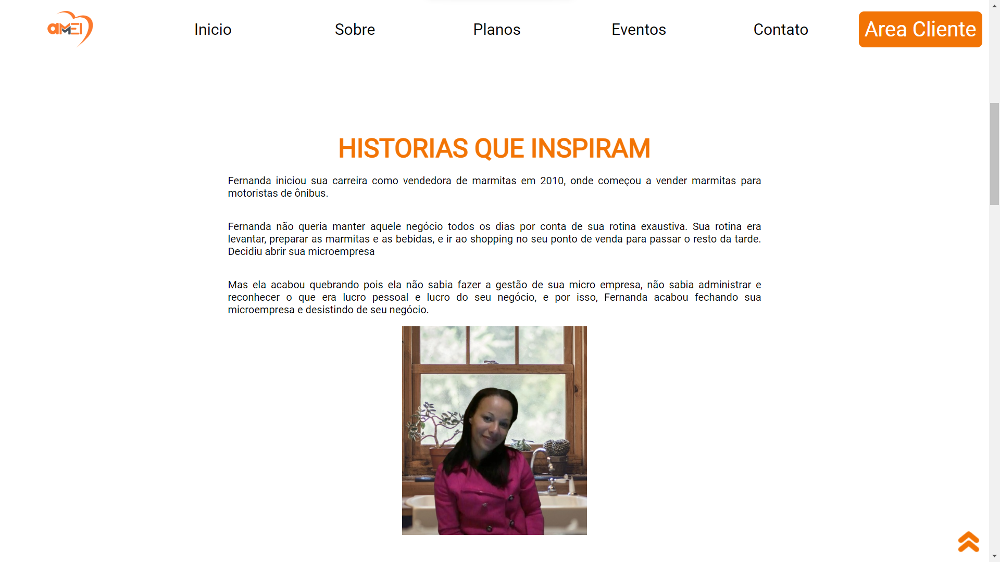
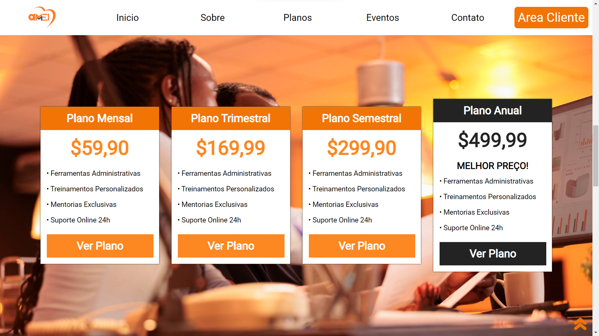
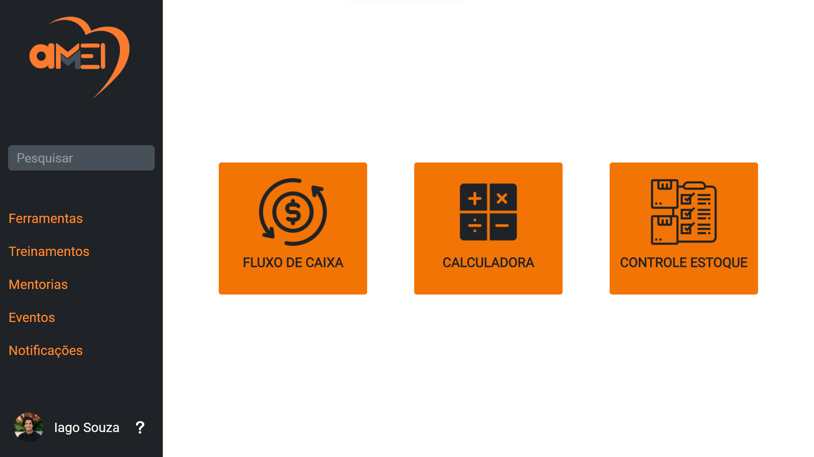
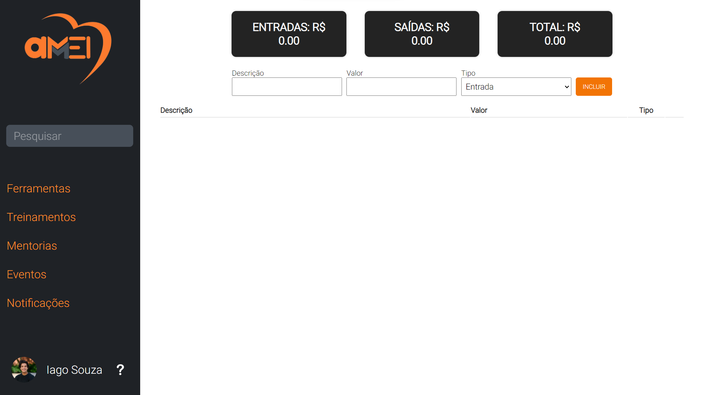
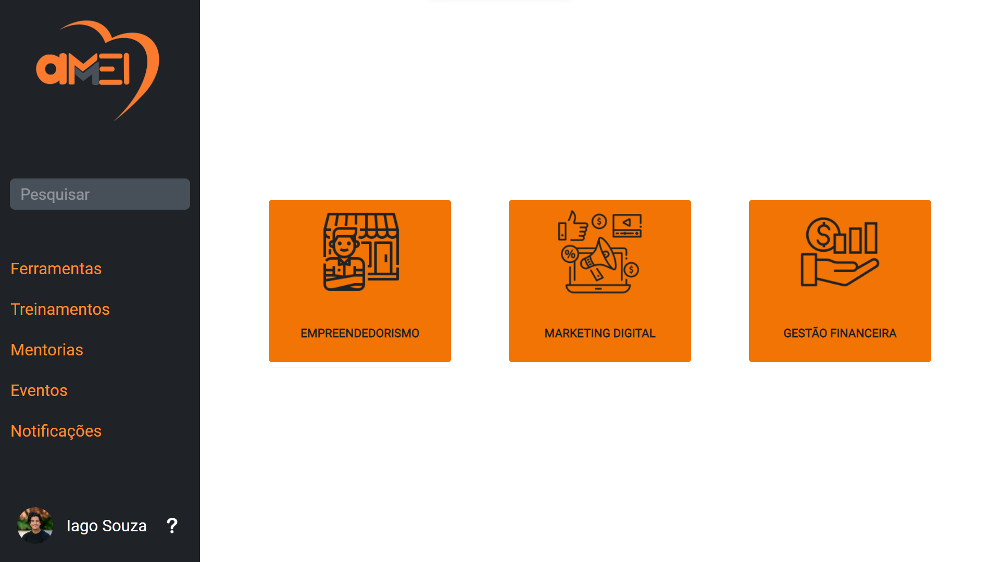
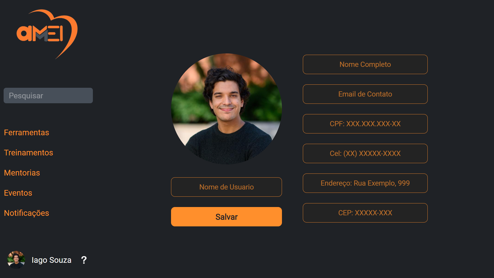

## Projeto Demoday - AMEI

A AMEI é um trabalho de conclusão de curso mais conhecido como um Projeto Demoday. Onde no Insituto PROA usamos todo conhecimentos aprendidos sobre programação na criação de uma Startup.
## Objetivos

O principal objetivo da AMEI é demonstrar os resultados alcançados a longo do período de implementação da plataforma. Este projeto visa apresentar como a AMEI contribuiu para a profissionalização dos MEIs do ramo alimentício, fornecendo as ferramentas necessárias para a gestão eficiente de seus negócios, bem como o desenvolvimento de habilidades empreendedoras.

## Metodologia

A AMEI utiliza uma abordagem prática e participativa para capacitar os MEIs. A metodologia inclui:

1. Mentorias especializadas: Os MEIs têm acesso a mentores especializados no ramo alimentício, que fornecem orientações e conselhos personalizados para o desenvolvimento de seus negócios.

2. Workshops e treinamentos: São oferecidos workshops e treinamentos abordando temas relevantes para os MEIs, como gestão financeira, marketing, atendimento ao cliente e boas práticas de higiene e manipulação de alimentos.

3. Ferramentas e recursos: A AMEI disponibiliza ferramentas e recursos especialmente desenvolvidos para auxiliar os MEIs na gestão de seus negócios, controle de estoque, fluxo de caixa  e calculadora.

## Resultados Esperados

Espera-se que a empresa AMEI demonstre os seguintes resultados:

1. Melhoria na gestão dos negócios dos MEIs: Os usúarios da plataforma devem adquirir conhecimentos e habilidades que os auxiliem na administração eficiente de suas empresas, resultando em um melhor controle financeiro, aumento da produtividade e otimização dos processos.

2. Crescimento dos negócios: Através da capacitação oferecida pela AMEI, espera-se que os MEIs sejam capazes de expandir seus negócios, aumentando sua clientela, diversificando seus produtos e serviços, e conquistando novos mercados.

3. Fortalecimento da comunidade empreendedora local: Ao capacitar os MEIs do ramo alimentício, a AMEI busca fortalecer a comunidade empreendedora local, promovendo a troca de experiências, o networking e a colaboração entre os participantes.

## Sobre o visual da plataforma
## Página Inicial

## Sobre

## Planos

### Essas seguem sendo as partes importantes a se destacar

## Ferramentas 

### 1º Fluxo de caixa

##  Tela de treinamentos

## Perfil do usúario

## Contato

Para mais informações sobre a AMEI,
Conheça e visite o [nosso site](https://amei-demoday.github.io/Plataforma/).
Acesse o [nosso linktree](https://linktr.ee/amei.ltda).
E visite o [instagram do projeto](https://www.instagram.com/ameioprojeto/).

